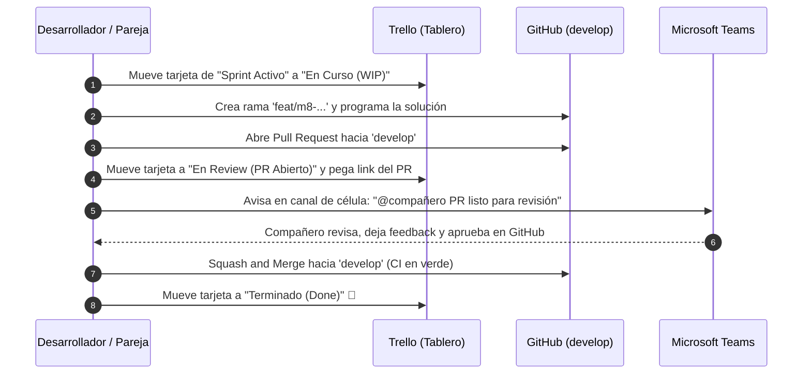

# Guía de Organización del Equipo con Microsoft Teams y Trello (Grupo 10 - M8)

Esta guía complementa a [CONTRIBUTING.md](CONTRIBUTING.md) y [ROLES.md](ROLES.md). Su propósito es establecer una dinámica de comunicación y gestión ágil para los **9 integrantes**, evitando saturación de mensajes y asegurando que cada persona sepa qué hacer en cada etapa del proyecto.

---

## 1. Estructura y Canales en Microsoft Teams

Para evitar un chat caótico donde se mezclen dudas de código con avisos de la cátedra, crearemos un equipo en Teams: **`[2026] G10 - Módulo 8`** con los siguientes canales organizados por temática:

### 📢 Canales Generales
| Canal | Propósito | Regla de Uso |
| :--- | :--- | :--- |
| **`#00-anuncios-catedra`** | Novedades oficiales, fechas de entrega (TP1/TP2/TP3), consignas docentes y links a clases. | Solo anuncios importantes (evitar charlas casuales). |
| **`#01-general-y-arquitectura`** | Coordinación general, acuerdos de diseño hexagonal, contratos OpenAPI y sincronización entre células. | Canal principal de debate técnico. |
| **`#02-infra-supabase-github`** | Credenciales de Supabase, variables de `.env`, CI/CD de GitHub Actions y despliegues. | Administrado principalmente por el **Tech Lead**. |
| **`#03-bloqueos-y-ayuda-git`** | "¿Me sale este error de rebase?", "No compila en mi máquina", "Problema con Prisma". | Espacio seguro para pedir auxilio técnico rápido. |

### 🛠️ Canales Específicos por Célula (Sub-equipos)
| Canal | Miembros Asignados | Foco de Trabajo |
| :--- | :--- | :--- |
| **`#celula-1-notificaciones`** | Dev 1 & Dev 2 (+ Tech Lead) | Consumo RabbitMQ, templates de email, Mailpit y tracking de envíos. |
| **`#celula-2-documentos-qr`** | Dev 3 & Dev 4 (+ Tech Lead) | Códigos QR con TTL, generación de comprobantes PDF y Supabase Storage. |
| **`#celula-3-soporte-tickets`** | Dev 5 & Dev 6 (+ Tech Lead) | CRUD de tickets, máquina de estados de soporte y endpoints REST. |
| **`#celula-4-frontend`** | Dev 7 & Dev 8 (+ Tech Lead) | Dashboard en React/Vite, vistas de tickets, scanner QR y demo en vivo. |

---

### ⏱️ Rutinas de Comunicación (Ceremonias Ágiles Ligeras)

1. **Check-in Asíncrono (Lunes y Jueves en Teams)**:
   - Cada integrante publica un mensaje breve de 3 líneas:
     - ✅ *¿Qué terminé?*
     - 🚀 *¿En qué voy a trabajar?*
     - 🚧 *¿Tengo algún bloqueo?*
2. **Sync Semanal (20 a 30 minutos por videollamada)**:
   - Los 9 nos reunimos una vez por semana (ej. Sábados a la mañana o Viernes tarde).
   - Cada célula muestra en 3 minutos lo que programó y se planifican las tarjetas de Trello para la semana siguiente.
3. **Integración con GitHub (Recomendado)**:
   - Agregar el webhook o bot de GitHub a Teams en el canal `#02-infra-supabase-github` para que avise automáticamente cuando alguien abre un Pull Request o falla el CI.

---

## 2. Gestión de Tareas con Trello (Tablero Kanban)

### 📌 Nombre del Tablero: `G10-M8: Notificaciones, Documentos y Soporte`

### 📋 Columnas Recomendadas (Workflow de Trabajo)

```text
┌──────────────┐ ┌──────────────┐ ┌──────────────┐ ┌──────────────┐ ┌──────────────┐ ┌──────────────┐
│  1. Backlog  │ │ 2. Sprint /  │ │ 3. En Curso  │ │ 4. En Review │ │ 5. Testing & │ │ 6. Terminado │
│   General    │ │  Hito Activo │ │    (WIP)     │ │ (PR Abierto) │ │  QA (develop)│ │    (Done)    │
└──────────────┘ └──────────────┘ └──────────────┘ └──────────────┘ └──────────────┘ └──────────────┘
```

1. **`1. Backlog General`**: Todas las tareas y requerimientos del enunciado (RF-8.1 al RF-8.8, RNF) desglosados en tarjetas individuales.
2. **`2. Sprint / Hito Activo`**: Las tareas seleccionadas específicamente para la entrega que se está preparando (ej. "Entrega TP1").
3. **`3. En Curso (WIP)`**: Tareas que un integrante o pareja está programando activamente en su rama local `feat/m8-...`. *Regla: Máximo 1 tarea activa por persona para no dispersarse.*
4. **`4. En Review (PR Abierto)`**: La tarea ya tiene código subido y su Pull Request está abierto en GitHub esperando la revisión del compañero de célula.
5. **`5. Testing & QA (develop)`**: El PR fue aprobado y mergeado a `develop`. Se prueba en conjunto con Supabase o Swagger.
6. **`6. Terminado (Done)`**: La funcionalidad está 100% probada, documentada y lista para la cátedra.

---

### 🏷️ Sistema de Etiquetas (Color Coding en Trello)

- 🟣 **`Célula 1: Notificaciones`** (RF-8.1, 8.2, 8.6, 8.8)
- 🟢 **`Célula 2: Documentos & QR`** (RF-8.3, 8.4, 8.5)
- 🔵 **`Célula 3: Soporte & Tickets`** (RF-8.7)
- 🟡 **`Célula 4: Frontend Backoffice`** (React / Vite UI)
- 🔴 **`Infra / Supabase / CI`** (DevOps, migraciones, Docker)
- 🟠 **`Bloqueo / Bug`** (Prioridad alta)

---

### 📝 Plantilla Estándar para Tarjetas de Trello

Cada tarjeta debe crearse con esta estructura clara:

- **Título**: `[RF-8.X] <Verbo imperativo> + <Descripción>`  
  *(Ej: `[RF-8.3] Generar código QR temporal con TTL en Redis y token de un solo uso`)*
- **Miembros**: Asignar a la pareja de la célula responsable.
- **Etiqueta**: Asignar el color correspondiente a la célula.
- **Descripción**:
  - Explicar brevemente qué se debe construir y qué archivos toca.
  - Colocar el nombre de la rama: `feat/m8-qr-generation`.
- **Checklist: Definition of Done (Criterios de Aceptación)**:
  - [ ] Entidad / Caso de uso implementado siguiendo arquitectura hexagonal.
  - [ ] Persistencia con Supabase / Prisma funcionando.
  - [ ] DTOs y respuestas documentadas en Swagger OpenAPI (`@ApiOperation`, `@ApiResponse`).
  - [ ] Pruebas unitarias ejecutadas localmente (`npm run test`).
  - [ ] Pull Request abierto hacia `develop` con la plantilla completada.
  - [ ] Aprobación del compañero de célula obtenida.
  - [ ] CI de GitHub Actions en verde y merge completado.

---

## 3. Dinámica entre Teams, Trello y GitHub


